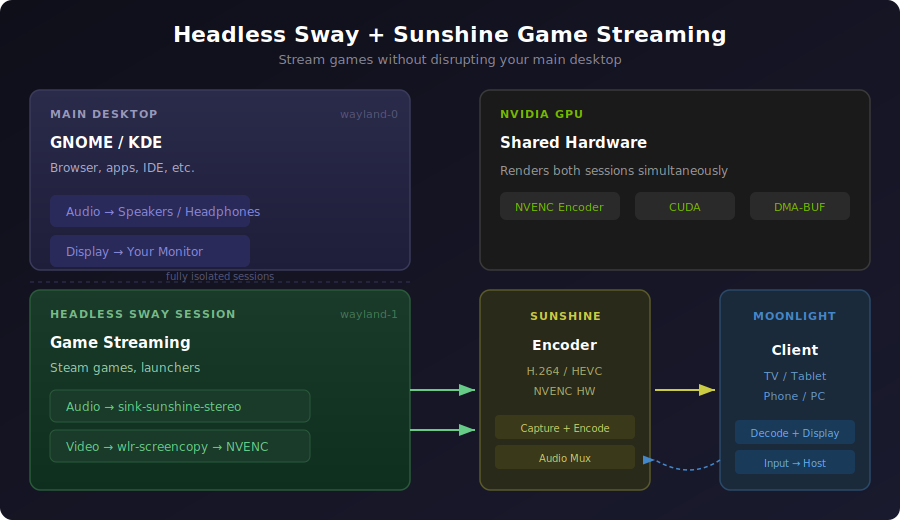

# Headless Sway + Sunshine Game Streaming

> **DISCLAIMER**: This is provided as-is with absolutely no warranty or guarantee. Use at your own risk. This may break your system, eat your configs, set your GPU on fire, or summon an elder god. The author(s) take no responsibility for anything that happens as a result of using this software. You have been warned.



Stream games from a headless Sway session using [Sunshine](https://github.com/LizardByte/Sunshine) and [Moonlight](https://moonlight-stream.org/), without disrupting your main desktop session.

This setup runs a separate headless Wayland compositor (Sway) dedicated to game streaming. Your primary desktop (GNOME, KDE, etc.) continues running normally — audio, display, and input are fully isolated.

## Why headless?

- Stream games without taking over your main display
- Dynamic resolution matching — the headless output adapts to your Moonlight client
- Game audio routes only to the stream, host audio is unaffected
- Works with NVIDIA GPUs using NVENC hardware encoding
- Minimal overhead when idle (~420MB RAM, negligible CPU)

## Requirements

- **OS**: Linux with systemd user services (tested on Ubuntu 25.10)
- **GPU**: NVIDIA with proprietary drivers (for NVENC)
- **Packages**: `sway`, `swaybg`, `pipewire`, `wireplumber`, `xdg-desktop-portal-wlr`
- **Sunshine**: [LizardByte Sunshine](https://github.com/LizardByte/Sunshine/releases) v2026.226+ (deb package recommended)
- **Client**: [Moonlight](https://moonlight-stream.org/) on any device

## Quick install

```bash
git clone https://github.com/daaaaan/sunshine-headless-sway.git
cd sunshine-headless-sway
./install.sh
```

The install script will:
- Install missing dependencies (`sway`, `swaybg`, `xdg-desktop-portal-wlr`)
- Auto-detect your Sunshine installation path
- Detect the correct Wayland display number and user ID
- Template all config files with your system's paths
- Install and enable the systemd services
- Preserve any existing Sunshine config you already have

## Manual setup

If you prefer to install manually, see the [manual setup guide](#manual-setup-guide) below.

## Architecture

```
┌─────────────────────────────────────────────────────┐
│  Main Desktop (GNOME/KDE)          wayland-0        │
│  └─ Normal apps, browser, etc.                      │
│  └─ Audio → your speakers/headphones                │
├─────────────────────────────────────────────────────┤
│  Headless Sway                     wayland-1        │
│  └─ Games launched via Sunshine                     │
│  └─ Audio → sink-sunshine-stereo → Moonlight stream │
│  └─ Video → wlr-screencopy → NVENC → Moonlight     │
└─────────────────────────────────────────────────────┘
```

Two systemd user services manage the stack:

1. **`sway-sunshine.service`** — runs a headless Sway compositor with no physical display
2. **`sunshine-headless.service`** — runs Sunshine pointed at the headless Sway session

## Adding games

Edit `~/.config/sunshine/apps.json` to add Steam games. Find the app ID on [SteamDB](https://steamdb.info/) and add an entry:

```json
{
  "name": "Game Name",
  "detached": [
    "swaymsg exec 'steam steam://rungameid/APP_ID'"
  ],
  "prep-cmd": [
    {
      "do": "~/.config/sway-sunshine/set-resolution.sh",
      "undo": ""
    }
  ]
}
```

Restart Sunshine after editing: `systemctl --user restart sunshine-headless.service`

## How it works

### NVIDIA + headless Sway renderer

The Sway service uses `WLR_RENDERER=gles2`. The Vulkan renderer has DRM format modifier incompatibilities with NVIDIA's headless backend that cause frame capture failures.

### Audio isolation

Game audio is routed exclusively to the Moonlight stream without touching your host audio:

- `PULSE_SINK=sink-sunshine-stereo` is set in the Sway service environment, so apps launched in the headless session output to Sunshine's virtual sink
- `audio_sink = sink-sunshine-stereo` in `sunshine.conf` tells Sunshine to capture from that sink
- Sunshine automatically creates the `sink-sunshine-stereo` virtual null-sink when a client connects
- `restore-default-sink.sh` runs as a prep command to prevent Sunshine from hijacking your host's default audio sink — it detects the change and restores it within seconds
- Your main desktop audio continues through your normal output device

### Dynamic resolution

When a Moonlight client connects, Sunshine runs `set-resolution.sh` as a prep command. This uses `SUNSHINE_CLIENT_WIDTH`, `SUNSHINE_CLIENT_HEIGHT`, and `SUNSHINE_CLIENT_FPS` environment variables to resize the headless output to match the client exactly. On disconnect, `reset-resolution.sh` reverts to 1080p.

### Wayland display numbering

The headless Sway session typically gets `wayland-1` (assuming your main desktop is `wayland-0`). The install script detects this automatically. To check manually:

```bash
ls /run/user/$(id -u)/wayland-*
```

### IPC socket

Sway creates its IPC socket at the path specified by `SWAYSOCK` (`/run/user/<uid>/sway-sunshine.sock`). The service cleans up stale sockets on restart via `ExecStartPre`. All `swaymsg` commands in the apps and scripts reference this socket explicitly.

## Troubleshooting

### Blank display / error code -1

- Check `~/.config/sunshine/sunshine.log` for `Frame capture failed`
- Ensure `WLR_RENDERER=gles2` is set in `sway-sunshine.service` (not `vulkan`)
- Verify Sunshine is connecting to the correct Wayland display

### No input / can't control games

- The `xdg-desktop-portal-wlr` package must be installed
- Check that `/dev/uinput` is accessible to your user (Sunshine's udev rules should handle this)

### Games don't launch

- Verify the Sway IPC socket exists: `ls -la /run/user/$(id -u)/sway-sunshine.sock`
- Test manually: `SWAYSOCK=/run/user/$(id -u)/sway-sunshine.sock swaymsg -t get_tree`
- If the socket is stale after a restart, the `ExecStartPre` cleanup in the service handles it

### Audio bleeds to host

- Verify `audio_sink = sink-sunshine-stereo` is in `~/.config/sunshine/sunshine.conf`
- Check `PULSE_SINK=sink-sunshine-stereo` is in `sway-sunshine.service`
- Verify the `restore-default-sink.sh` prep command is in `apps.json` — without it, Sunshine sets `sink-sunshine-stereo` as the system-wide default, routing all host audio into the stream
- Confirm your default sink after connecting: `wpctl status | grep '\*'`

### UPnP port mapping failures

These errors (`Failed to map UDP/TCP`) are harmless if you're connecting over LAN or a VPN like Tailscale. They only matter for WAN connections through your router.

## Manual setup guide

If you'd rather not use the install script:

### 1. Install dependencies

```bash
sudo apt install sway swaybg xdg-desktop-portal-wlr
```

### 2. Copy config files

```bash
# Sway config and scripts
mkdir -p ~/.config/sway-sunshine
cp sway-sunshine/config ~/.config/sway-sunshine/
cp sway-sunshine/set-resolution.sh ~/.config/sway-sunshine/
cp sway-sunshine/reset-resolution.sh ~/.config/sway-sunshine/
chmod +x ~/.config/sway-sunshine/*.sh

# Sunshine config
cp sunshine/sunshine.conf ~/.config/sunshine/sunshine.conf
cp sunshine/apps.json ~/.config/sunshine/apps.json

# Systemd services
mkdir -p ~/.config/systemd/user
cp systemd/sway-sunshine.service ~/.config/systemd/user/
cp systemd/sunshine-headless.service ~/.config/systemd/user/
```

### 3. Edit paths

Update the following in the copied files to match your system:

- `sunshine-headless.service`: set `ExecStart` to your Sunshine path, `WAYLAND_DISPLAY` to your headless display
- `sway-sunshine.service`: update `/run/user/1000/` to `/run/user/$(id -u)/` if your UID isn't 1000
- `apps.json`: update `/home/YOUR_USER/` to your home directory
- `set-resolution.sh` / `reset-resolution.sh`: update the socket path if your UID isn't 1000

### 4. Enable and start

```bash
systemctl --user daemon-reload
systemctl --user enable --now sway-sunshine.service
systemctl --user enable --now sunshine-headless.service
```

### 5. Pair with Moonlight

Open Moonlight, find your host, and pair using the PIN at `https://YOUR_HOST:47990`.

## File structure

```
~/.config/
├── sway-sunshine/
│   ├── config                  # Headless Sway compositor config
│   ├── set-resolution.sh       # Dynamic resolution on connect
│   ├── reset-resolution.sh     # Reset resolution on disconnect
│   └── restore-default-sink.sh # Prevents Sunshine from hijacking host audio
├── sunshine/
│   ├── sunshine.conf           # Sunshine server config
│   └── apps.json               # Game/app entries for Moonlight
└── systemd/user/
    ├── sway-sunshine.service   # Headless Sway compositor service
    └── sunshine-headless.service # Sunshine streaming service
```

## License

MIT — do whatever you want with it, but don't blame us if something breaks.
