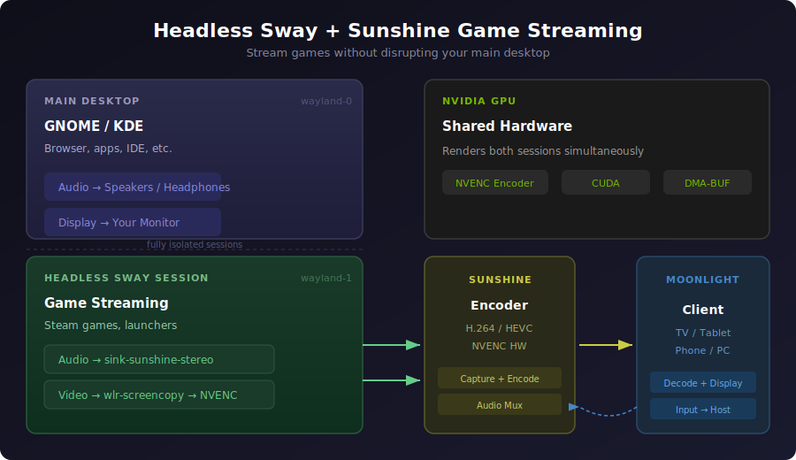

# Headless Sway + Sunshine Game Streaming

> **DISCLAIMER**: This is provided as-is with absolutely no warranty or guarantee. Use at your own risk.



Stream games from a headless Sway session using [Sunshine](https://github.com/LizardByte/Sunshine) and [Moonlight](https://moonlight-stream.org/), without disrupting your main KDE Plasma desktop.

This setup runs a separate headless Wayland compositor (Sway) dedicated to game streaming. Your KDE desktop continues running normally — audio, display, and input are fully isolated.

## Why headless?

- Stream games without taking over your main display
- Dynamic resolution matching — the headless output adapts to your Moonlight client
- Game audio routes only to the stream, host audio is unaffected
- Works with NVIDIA GPUs using NVENC hardware encoding
- Minimal overhead when idle (~420MB RAM, negligible CPU)

## Requirements

- **OS**: CachyOS / Arch Linux with systemd
- **GPU**: NVIDIA with proprietary drivers (for NVENC)
- **Packages**: `sway`, `swaybg`, `pipewire`, `wireplumber`, `xdg-desktop-portal-wlr`
- **Sunshine**: [LizardByte Sunshine](https://github.com/LizardByte/Sunshine/releases) (`sunshine` AUR package)
- **Client**: [Moonlight](https://moonlight-stream.org/) on any device

## Quick install

```bash
git clone https://github.com/YOUR_FORK/sunshine-headless-sway.git
cd sunshine-headless-sway
./install.sh
```

The install script will:
- Install missing dependencies (`sway`, `swaybg`, `xdg-desktop-portal-wlr`) via pacman
- Check `input` group membership and offer to add you
- Copy all config files to `~/.config/`
- Install and enable the systemd services
- Set up PipeWire audio isolation
- Remove any stale udev input isolation rules (they break headless Sway input)
- Mask the system `sunshine.service` to prevent port conflicts

## Architecture

```
┌─────────────────────────────────────────────────────┐
│  KDE Plasma (main desktop)         wayland-0        │
│  └─ Normal apps, browser, etc.                      │
│  └─ Audio → your speakers/headphones                │
├─────────────────────────────────────────────────────┤
│  Headless Sway                     wayland-1        │
│  └─ Games launched via Sunshine                     │
│  └─ Audio → sink-sunshine-stereo → Moonlight stream │
│  └─ Video → wlr-screencopy → NVENC → Moonlight     │
└─────────────────────────────────────────────────────┘
```

Two systemd user services manage the stack:

1. **`sway-sunshine.service`** — runs a headless Sway compositor with no physical display
2. **`sunshine-headless.service`** — runs Sunshine pointed at the headless Sway session

## How it works

### NVIDIA + headless Sway renderer

The Sway service uses `WLR_RENDERER=gles2` by default. This avoids DRM format modifier incompatibilities with NVIDIA's headless backend when using the Vulkan renderer.

### Audio isolation

Game audio is routed exclusively to the Moonlight stream without touching your host audio:

- A persistent PipeWire null sink (`sink-sunshine-stereo`) is created via config drop-in — it always exists, even when Moonlight is disconnected
- `PULSE_SINK=sink-sunshine-stereo` is set in the Sway service environment, so apps in the headless session output to this sink
- `audio_sink = sink-sunshine-stereo` in `sunshine.conf` tells Sunshine to capture from that sink
- `restore-default-sink.sh` runs as a prep command to prevent Sunshine from hijacking your host's default audio sink
- Your main desktop audio continues through your normal output device

### Dynamic resolution

When a Moonlight client connects, Sunshine runs `set-resolution.sh` as a prep command. This uses `SUNSHINE_CLIENT_WIDTH`, `SUNSHINE_CLIENT_HEIGHT`, and `SUNSHINE_CLIENT_FPS` environment variables to resize the headless output to match the client exactly. On disconnect, `reset-resolution.sh` reverts to 1080p.

### Input isolation

Input isolation is handled entirely by the Sway config — no udev rules are needed. The headless Sway session uses `WLR_BACKENDS=headless,libinput` with `LIBSEAT_BACKEND=noop` and runs under the `input` group via `sg` to access input devices.

The Sway config (`sway-sunshine/config`) disables all physical host devices with `input * events disabled` and selectively enables only Sunshine's virtual passthrough devices (vendor `0xBEEF`, product `0xDEAD`). This means your physical keyboard and mouse don't leak into the streaming session, and Moonlight input doesn't affect your KDE desktop.

> **Warning**: Do NOT install a udev rule that strips `ID_INPUT` tags from Sunshine's virtual devices. This hides them from all libinput consumers, including the headless Sway session, breaking input entirely.

## Troubleshooting

### Blank display / error code -1

- Check `~/.config/sunshine/sunshine.log` for `Frame capture failed`
- Ensure `WLR_RENDERER=gles2` is set in `sway-sunshine.service`
- Verify Sunshine is connecting to the correct Wayland display

### No input / can't control games

- If a udev rule at `/etc/udev/rules.d/85-sunshine-input-isolation.rules` exists, **remove it** — it strips `ID_INPUT` tags and breaks headless Sway input. The install script removes it automatically.
- The `xdg-desktop-portal-wlr` package must be installed
- Check that `/dev/uinput` is accessible to your user
- Verify Sunshine's virtual devices appear: `SWAYSOCK=/run/user/$(id -u)/sway-sunshine.sock swaymsg -t get_inputs` — look for devices with vendor `48879`

### Games don't launch

- Verify the Sway IPC socket exists: `ls -la /run/user/$(id -u)/sway-sunshine.sock`
- Test manually: `SWAYSOCK=/run/user/$(id -u)/sway-sunshine.sock swaymsg -t get_tree`

### Audio bleeds to host

- Verify `audio_sink = sink-sunshine-stereo` is in `~/.config/sunshine/sunshine.conf`
- Check `PULSE_SINK=sink-sunshine-stereo` is in `sway-sunshine.service`
- Verify `restore-default-sink.sh` is in `apps.json` prep commands
- Confirm your default sink after connecting: `wpctl status | grep '\*'`

### UPnP port mapping failures

These errors (`Failed to map UDP/TCP`) are harmless if you're connecting over LAN or a VPN like Tailscale.

## File structure

```
~/.config/
├── pipewire/pipewire.conf.d/
│   └── sunshine-null-sink.conf # Persistent audio sink (survives disconnect)
├── sway-sunshine/
│   ├── config                  # Headless Sway compositor config (input isolation)
│   ├── set-resolution.sh       # Dynamic resolution on connect
│   ├── reset-resolution.sh     # Reset resolution on disconnect
│   └── restore-default-sink.sh # Prevents Sunshine from hijacking host audio
├── sunshine/
│   ├── sunshine.conf           # Sunshine server config
│   └── apps.json               # App entries for Moonlight
└── systemd/user/
    ├── sway-sunshine.service   # Headless Sway compositor service
    └── sunshine-headless.service # Sunshine streaming service
```

## License

MIT — do whatever you want with it, but don't blame us if something breaks.
